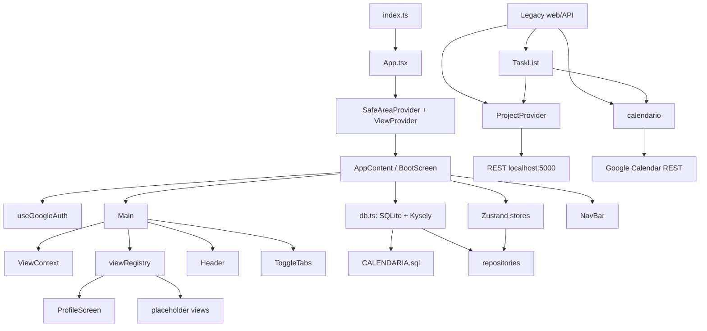
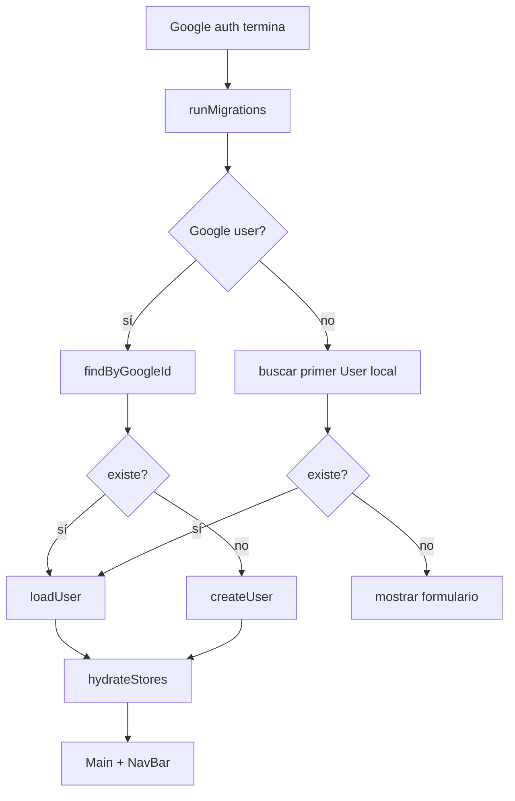

# NeuroPlanner — arquitectura, paquetes y APIs

> Revisión basada en el código fuente actual (2026-08-14). `?` = opcional. `UUID` = `string`; `Timestamp` = milisegundos Unix.

## Plataforma

| Área | Implementación |
|---|---|
| Cliente | Expo 54, React Native 0.81, React 19 |
| Estado | React Context (`ViewContext`) y Zustand |
| Persistencia local | Expo SQLite (`app_data.db`) + Kysely |
| Inicio de sesión | Google Sign-In/SecureStore y alternativa email/contraseña local |
| Subsistema heredado | DOM/HTML5 DnD + Axios/REST `localhost:5000`; no es compatible con React Native tal como está |

## Diagrama de paquetes

## Arranque y componentes nativos

| Símbolo | Parámetros / props | Función |
|---|---|---|
| `App()` | — | Raíz: instala `SafeAreaProvider` y `ViewProvider(defaultView={Vista.Tareas})`. |
| `AppContent()` | — | Ejecuta migración, carga/crea usuario, hidrata stores y muestra el shell cuando está listo. |
| `hydrateStores()` | — | `loadObjectives()` y `loadTemplates().then(loadDailyInstances())`. |
| `BootScreen` | `onGoogleSignIn`, `onEmailRegister(email,password,name)`, `onEmailLogin(email,password)`, `bootMessage`, `showForm` | Formulario login/registro. Sus props son `any` actualmente. |
| `BootScreen.handleSubmit()` | — | Valida credenciales y llama al callback de login o registro. |
| `useGoogleAuth()` | — | `{ user, accessToken, loading, isSignedIn, signIn(), signOut() }`; persiste sesión en SecureStore. |
| `ViewProvider` | `children`, `defaultView?: Vista` | Provee `currentView` y `changeView`. |
| `useView()` | — | Consume `{ currentView, changeView }`; falla fuera del provider. |
| `NavBar` | `onViewChange(view: Vista)`, `initialView?: Vista` | Navegación primaria. |
| `NavItem` | `label`, `icon`, `isActive`, `onPress`, `highlightColor?` | Subcomponente pulsable de `NavBar`. |
| `Main` | `accessToken?: string` | Resuelve vista, cabecera y tabs; mantiene `viewMode`. |
| `Header` | `currentActiveView: Vista` | Etiqueta/acento de la vista. |
| `ToggleTabs` | `tabs`, `activeView`, `onPress(target)`, `backgroundColor?` | Selector secundario; no muestra nada sin tabs. |
| `Soon` | `{ name: string }` | Placeholder de pantallas no implementadas. |
| `ProfileScreen` | — | Perfil, preferencias, contraseña, batería, métricas y contactos. |
| `SectionHeader` | `{title}` | Cabecera de sección. |
| `Card` | `{children}` | Contenedor visual. |
| `Row` | `{label, value}` | Fila de datos de solo lectura. |

### Flujo de bootstrap

## Registro de vistas

`ViewComponentProps` = `{ accessToken?, changeView(view), viewMode, setViewMode(mode), events?: any[] }`.

| Vista | Tabs | Render actual |
|---|---|---|
| `Tareas` | `day`, `week`, `schedule` | Texto `Tareas!` únicamente si hay token. |
| `Proyectos` | `list`, `sunburst`, `schedule` | `Soon("ProjectsPage")`. |
| `Premios` | — | `Soon("Premios")`. |
| `Dia_1` | — | `Soon("DiaCalendario")` con token. |
| `Dia_2` | — | `Soon("ArcTimeline")`. |
| `Semanas`, `Meses`, `Dias` | — | Placeholders. |
| `Settings` | — | Carga dinámica de `ProfileScreen`. |

## Repositorios: funciones y contratos

| Repositorio | API pública |
|---|---|
| `BaseEntityRepository(db)` | `create(id,type,data)`, `findById(id)`, `findByType(type)`, `findByTypes(types)`, `listAll(limit=100,offset=0)`, `update(id,data)` (reemplaza JSON), `patch(id,partial)` (merge superficial), `delete(id)`, `deleteByType(type)`. |
| `UserRepository(db)` | `upsertSocialBattery(userId,currentLevel,recoveryRate?)`, `getSocialBattery(userId)`, `adjustSocialBattery(userId,delta)`, contacto CRUD, `upsertDailyMetrics(metrics)`, `getDailyMetrics(userId,date)`, `getMetricsInRange(userId,from,to)`, `createUser(userId,profileData,initialBattery?,recoveryRate?)`, `createProfile(profileId,profileData)`, `findByGoogleId(googleId)`, `findByEmail(email)`, `createWithPassword({id,email,hashedPassword,name,initialBattery?,recoveryRate?})`. |
| `ObjectiveRepository(db)` | `createObjective({id,type: Goal\|Project\|Task,data,parentId?,progress?,isActive?,dueDate?})`, `findById`, `findByTypes`, `findByParent`, `getTree`, `setProgress`, `setActive`, `reparent`, `setDueDate`, `updateObjective(id,data,{progress?,isActive?,parentId?,dueDate?}?)`, `link`, `unlink`, `delete`. |
| `HabitRepository(db)` | Plantillas: `createTemplate(template)`, `getTemplate`, `listTemplates`, `updateTemplate`, `deleteTemplate`; instancias: `createInstance({template_id,scheduled_date,id?})`, `completeInstance(instanceId,prevStreak)`, `uncompleteInstance`, `getDailyHabits(date)`, `calculateStreak(templateId,fromDate)`, `deleteInstance`. |
| `ReflectionRepository(db)` | `create({id?,userId,type,timestamp?,data})`, `findById`, `findByUser(userId,type?,limit=50,offset=0)`, `findByDateRange(userId,from,to,type?)`, `getLatestCrisis`, `update`, `delete`. |
| `RewardRepository(db)` | `createReward(reward)`, `getReward`, `listRewards(includeFavoritesOnly=false)`, `updateReward`, `toggleFavorite`, `deleteReward`, `redeem({userId,rewardId,pointsSpent?})`, historial y total de puntos. |
| `TrackingRepository(db)` | `recordMetric({entityId,metricName,value,timestamp?,context?})`, `recordMetrics(points)`, `getHistory({entityId,metricNames?,from?,to?,limit?})`, `getLatest`, `aggregate({entityId,metricName,from?,to?,fn})`; duplica API de métricas diarias. |

## Stores Zustand

| Store | Estado / acciones |
|---|---|
| `useUserStore` | Usuario, perfil, batería, contactos, métricas, loading/error. `loadUser`, `createUser`, `upsertProfile`, batería/métricas/contactos CRUD, `registerWithEmail`, `loginWithEmail`, `changePassword`, `reset`. |
| `useObjectiveStore` | `flatMap`, `roots`, `tree`, `dirtyIds`. `loadAll`, `loadTree`, `create`, `update`, `reparent`, `setProgress`, `toggleActive`, `remove`, árbol/dirty/reset. |
| `useHabitStore` | Plantillas, instancias del día, rachas. Carga, CRUD, completar/descompletar/toggle, refresco de rachas, reset. |
| `useReflectionStore` | Usuario, recientes y drafts. Carga, start/update/save de journal/conversation/crisis, escalado, borrar, reset. |
| `useSkillStore` | Skills, drills, sesión activa/historial. Carga, CRUD, mastery, iniciar/completar sesión, historial, reset. |

## Subsistema heredado no conectado

| Elemento | Parámetros / responsabilidad |
|---|---|
| `AnimatedTaskManager` | `accessToken`, `setCurrentView`, `onDragStateChange?`, `viewMode`, `setViewMode`; gestor web de tareas/calendario/drawers/drag-drop. |
| `WeekViewRender` | `currentDate`, `setCurrentDate`, `viewMode`, `setViewMode`; adaptador semanal. |
| `TaskItem` | `TaskItemProps`, callbacks; editor HTML y DnD. |
| `TaskBlockComponent` | Bloque + setters/callbacks; renderiza `TaskItem` anidados. |
| `ProjectProvider` / `useProject` | Contexto de tareas/proyectos/recompensas/imágenes REST. |
| `maxid(table)` | Consulta el máximo ID en API heredada. |
| `calendario.tsx` | Utilidades de tiempo/grid/conversión Google; CRUD Google (`upsertEvent`, `createEvent`, `updateEvent`, `deleteEvent`), colores y `localStorage` de tags. |

## Hallazgos prioritarios

1. Existen **dos arquitecturas incompatibles**: SQLite/Zustand nativa y REST/DOM web. No se sincronizan.
2. `Tareas` no monta el gestor heredado: sólo muestra `Tareas!`; el gestor web no está en la navegación activa.
3. El token denominado `accessToken` es un `idToken`; Google Calendar REST requiere OAuth access token con scopes de Calendar.
4. La contraseña local se guarda como hash SHA-256 derivado en JSON SQLite; no es apropiado para proteger datos sensibles. Usar proveedor de auth o KDF con sal aleatoria por usuario.
5. `objectives.parent_id` y `objective_links` son dos fuentes de verdad. `updateObjective(parentId)` no actualiza links y los lectores usan modelos distintos.
6. `getTree()` no evita ciclos; un enlace circular puede no terminar.
7. `drill_sessions` no tiene cascada hacia `drills`; borrar un skill puede quedar bloqueado con FKs activas.
8. `NavBar` duplica estado de vista; cambios programáticos pueden dejar el resaltado desfasado. `Main` no reinicia `viewMode` al cambiar vista.
9. Props `any`, placeholders y renderizadores invocados como funciones reducen seguridad de tipos y dificultan pantallas futuras con hooks.

Ver también: [`DATABASE_ERD.md`](./DATABASE_ERD.md).
