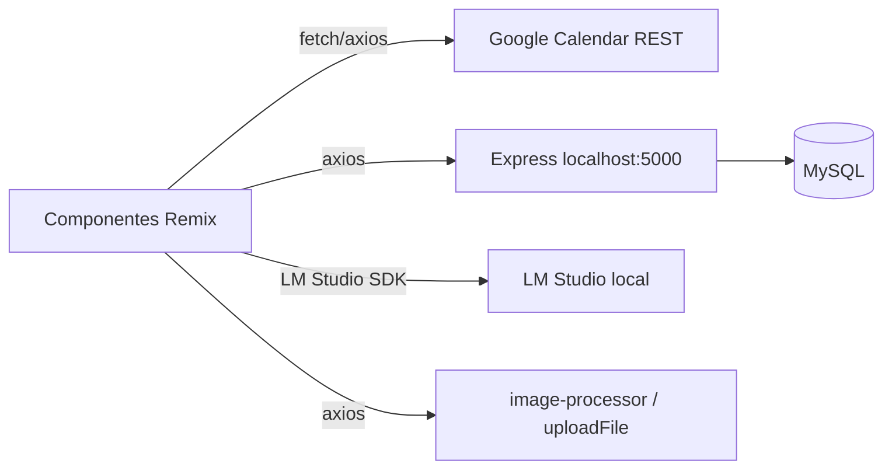
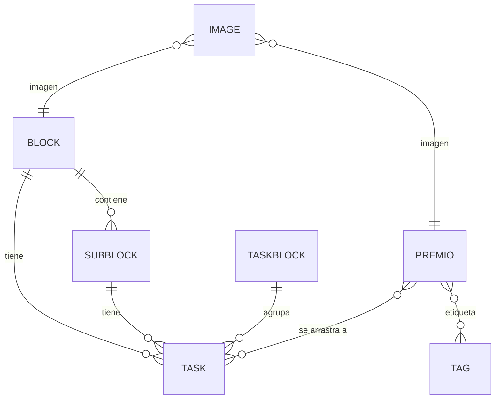

# Calendario Antiguo — Análisis funcional completo

> Revisión basada en el código fuente de `calendario_antiguo/` (2026-08-18). Este documento describe **qué hace** el sistema, cómo está organizado y qué hallazgos conviene conservar o evitar al migrar a NeuroPlanner.

---

## 1. Resumen

`calendario_antiguo` es una **app web de calendario personal** ("Libro de placeres de Diego") construida con **Remix + React**, que combina:

- **Tareas y eventos** gestionados en **Google Calendar** (fuente de verdad) y espejados en una **base MySQL** vía una **API Express** en `localhost:5000`.
- **Proyectos / Metas** jerárquicos (bloques y sub-bloques) con tareas asociadas.
- **Premios / Recompensas** (carrusel de "placeres") que se pueden **arrastrar sobre eventos del calendario**.
- **Múltiples visualizaciones**: día, semana, meses, semanas-scroll, sunburst, timeline, dona/arco, horario semanal transversal.
- **IA local** (LM Studio) para descomponer tareas/proyectos en subtareas.
- **Procesamiento de imágenes** (screenshot/PDF → imagen) para los premios.

Es una app **mobile-first** (layout de ancho máximo `max-w-sm`, barra de navegación inferior) aunque corre en navegador.

---

## 2. Stack y arquitectura

| Área | Implementación |
|---|---|
| Framework | Remix 2 (`@remix-run/*`), React 18, TypeScript |
| UI | Tailwind CSS, Radix UI, MUI, framer-motion, lucide-react |
| Drag & drop | `@hello-pangea/dnd`, `react-dnd`, `react-draggable`, `dnd-kit` |
| Gráficos | `d3`, `d3-cloud`, `react-native-svg` (en dona) |
| Backend | API Express en `http://localhost:5000` (no está en este repo) |
| Base de datos | MySQL vía Prisma/Sequelize (`mysql2`, `@prisma/client`) |
| Calendario | Google Calendar REST API (`googleapis`, OAuth token en `localStorage`) |
| IA | `@lmstudio/sdk` → modelo local `deepseek-r1-distill-llama-8b@q4_k_m` |
| Imágenes | `sharp`, `puppeteer`, `multer` (subida) |

### Flujo de datos



- **Google Calendar** es la fuente de verdad de tareas/eventos (CRUD directo con el `accessToken`).
- **MySQL** guarda proyectos, sub-proyectos, bloques de tareas, premios, imágenes y un espejo de tareas.
- La sincronización entre ambos es **manual y parcial** (ver §9).

---

## 3. Modelo de datos (entidades)

Definido en `app/lib/types.tsx` y usado por `proyecto-utils.tsx` (contexto `ProjectProvider`).

| Entidad | Campos clave | Propósito |
|---|---|---|
| `Task` (tarea/evento) | `id`, `summary`, `description`, `isEvent`, `colorId`, `start/end` (`dateTime` o `date`), `recurrence`, `reminders`, `transparency`, `tags`, `proyecto`, `subproyecto`, `bloque_tareas`, `premio`, `imagen` | Unidad base; puede ser tarea (todo el día) o evento (con hora). |
| `Block` (proyecto) | `id`, `name`, `description`, `color`, `startdate`, `enddate`, `tareas[]`, `subBlocks[]`, `isExpanded`, `image` | Proyecto raíz jerárquico. |
| `SubBlock` (sub-proyecto) | igual que `Block` + `parentId`, `parent_sub_id` | Nivel anidado (hasta profundidad 3). |
| `TaskBlock` (bloque de tareas) | `id`, `title`, `expanded`, `type` (`task`/`event`/`both`), `color`, `tareas[]`, `top`, `height`, `image` | Agrupación visual de tareas en el día. |
| `Premio` (recompensa) | `id`, `nombre`, `descripcion`, `url`, `imagen`, `tipo`, `fav`, `esfuerzo`, `tags`, `idEvento[]`, `hora_inicio/fin_preferida` | "Placer" o recompensa; se arrastra al calendario. |
| `Image` | `id`, `table_name`, `external_id`, `image_url` | Imagen asociada a premios/proyectos/tareas. |
| `TagType` | `id`, `name`, `color`, `vista` | Etiquetas de color (persistidas en `localStorage`). |

### Relaciones



---

## 4. Navegación y vistas

`Vista` (enum en `types.tsx`) y `viewRegistry` (en `calendario.tsx`) definen las pantallas. La barra inferior (`NavBar`) navega entre: **Today, Rewards, Aims, Monitor, Settings**.

| Vista | Tabs | Componente | Función |
|---|---|---|---|
| `Tareas` (Today) | `day`, `week`, `schedule` | `AnimatedTaskManager` | Gestor principal de tareas/eventos. |
| `Proyectos` (Aims) | `list`, `sunburst`, `schedule` | `ProjectsPage` | Proyectos jerárquicos + visualizaciones. |
| `Premios` (Rewards) | — | `Premios` | Carrusel de recompensas. |
| `Dia_1` | — | `DiaCalendario` | Grid de día con drag/resize. |
| `Dia_2` (Monitor) | — | `IndependentArcTimeline` | Dona/arco de tareas del día. |
| `Semanas` / `Meses` / `Dias` | — | `Dias` | Scroll de semanas con drop de proyectos. |
| `Settings` | — | `Dias` (placeholder) | Ajustes. |

---

## 5. Funcionalidades principales

### 5.1 Gestión de tareas y eventos (`AnimatedTaskManager`, `TaskList.tsx`)

El corazón de la app. Permite:

- **Crear tareas** (todo el día) y **eventos** (con hora de inicio/fin).
- **Convertir tarea ↔ evento** (botón "Convertir a evento" / "Convertir a tarea").
- **Repetición** (`task-editor.tsx`): `none`, `daily`, `weekly`, `monthly`, `annually`, `workdays`, `custom` (cada X semanas).
- **Tags** por tarea (sistema de etiquetas con color).
- **Completar** tareas (checkbox / `transparency: transparent`).
- **Drag & drop** para reordenar tareas, moverlas entre bloques y entre días de la semana.
- **Bloques de tareas** (`TaskBlock`): agrupar tareas bajo un título/color; se pueden crear arrastrando una tarea sobre otra.
- **Drawers** de premios y metas (para arrastrar al calendario).
- **Reloj de tiempo** (`MobileTimePicker`): selector de hora analógico (hora/minuto, AM/PM).
- **Sincronización con Google Calendar** cada 60s (ver §9).

### 5.2 Vista de día (`Dia.tsx`, `DiaCalendario`)

Grid horario (0–24h, filas de 15 min) con:

- **Crear evento arrastrando** sobre el grid (se dibuja un "square" temporal).
- **Redimensionar** eventos desde el borde superior/inferior (snap a 10px).
- **Mover** eventos verticalmente.
- **Detección de solapamientos** (`detectOverlaps`) → agrupa eventos que se solapan y los divide en columnas.
- **Selector de color** (mapea HEX ↔ `colorId` de Google Calendar).
- **Arrastrar premios** sobre un evento (ver §5.4).
- **Overlay de edición** para poner título/color al crear o actualizar.

### 5.3 Vista de semana (`week-view.tsx`, `WeekViewRender`)

- Grid de 7 días (lunes a domingo).
- Arrastrar tareas entre días (`@hello-pangea/dnd`).
- Marcar completadas, editar, eliminar, convertir a evento.
- Badges de proyecto y recurrencia.
- Añadir tarea/evento por día.

### 5.4 Premios / Recompensas (`Premios.tsx`, `premio-*`)

- **Carrusel** de premios agrupados por **tag** (con blur en los laterales).
- **Esfuerzo** (0–3 estrellas) por premio.
- **Favoritos** (star).
- **Reordenar** por drag & drop (persiste orden vía `/api/premios/reorder`).
- **Editar/Crear** con formulario (`PopupEdit`): nombre, URL, descripción, imagen, tags, esfuerzo.
- **Extraer imagen** desde URL o PDF (vía `image-processor`).
- **Arrastrar premio al calendario**: en la vista de día, un premio se suelta sobre un evento y queda asociado (`idEvento`), mostrando la imagen circular sobre el bloque. Doble clic lo desasocia.
- **Vista swap** (`PremioListSwap`): círculos arrastrables (modo "celular") para soltar premios en el día.

### 5.5 Proyectos / Metas (`listaproyectos.tsx`, `proyecto-utils.tsx`)

- **Jerarquía** de proyectos → sub-proyectos (hasta profundidad 3).
- Cada bloque muestra **fechas** y **progreso** (`completadas/total`).
- **Expandir/colapsar**, **editar título** inline, **eliminar** (con opción de borrar tareas/sub-proyectos).
- **Añadir sub-componente**.
- **Dividir con IA** (`requestAIOperation`): descompone un proyecto/tarea en subtareas usando LM Studio.
- **Agrupación temporal**: "Esta semana", "Este mes", "Otros proyectos" según `startdate`.
- **Drag & drop** de bloques para reordenar y anidar.

### 5.6 Scroll de semanas (`listasemanas.tsx`, `WeekScroller`)

- Genera semanas de ±1 año alrededor del año actual.
- **Arrastrar proyectos/sub-proyectos** desde la lista y soltarlos en una semana concreta (dropzone por semana).
- Evita duplicados (mismo contenido + semana).
- Navegación por año y botón "This Week".
- Scroll con arrastre (mouse/touch).

### 5.7 Visualizaciones de proyectos

- **Sunburst** (`sunburst-crud-app.tsx`): gráfico radial con CRUD de nodos (añadir/editar/borrar hijos), modo día/noche, y generación de nodos con IA.
- **Timeline scheduler** (`timelinescheduler.tsx`): línea de tiempo con tareas, hitos, colapso de nodos, tooltip de fechas, calendario de selección de rango, y configuración de proyecto (nombre, descripción, fechas).

### 5.8 Dona / Arco de tareas (`circulol.tsx`, `IndependentArcTimeline`)

- Vista "Monitor": tareas del día dibujadas como **arcos** en un dona.
- Detecta **tareas paralelas** (solapadas) y ajusta radios para no solaparse.
- Permite **redimensionar/mover** arcos arrastrando (cambia horas de inicio/fin).
- `InteractiveDonut`: dona con segmentos redimensionables.

### 5.9 Horario semanal transversal (`cositos/dias.tsx`, `WeeklySchedule`)

- Grid de 7 días × 24h.
- **Bloques transversales** (se aplican a todos los días) y **bloques individuales** por día.
- Crear, mover, redimensionar (top/bottom), colorear, nombrar.
- **Plantillas** de horario predefinidas.
- **Detección de bloques de sueño** (noche + duración larga).
- Atajos de teclado (Esc, Ctrl+R para reset).

### 5.10 Sistema de tags (`tags.tsx`)

- Buscar/crear etiquetas con color (mapeado a colores de Google Calendar).
- Persistencia en `localStorage` (`savedTags`).
- Una tarea/premio puede tener una etiqueta (el sistema reemplaza la selección actual).
- Las etiquetas se usan para **agrupar premios** en el carrusel.

### 5.11 Procesamiento de imágenes (`image-processor.tsx`, `PopupEdit`)

- **Extraer imagen** desde una URL (screenshot) o PDF.
- **Subir archivo** de imagen (`/uploadFile`) o metadatos (`/uploadMetadata`).
- Vista previa, drag & drop de archivo.
- `sharp`/`puppeteer` en el backend para generar la imagen.

### 5.12 IA local (`ia.tsx`)

- Conecta a **LM Studio** (`ws://127.0.0.1:1234`).
- Modelo: `deepseek-r1-distill-llama-8b@q4_k_m`.
- Devuelve JSON estructurado (`{ tasks: [{ summary }] }`).
- Se usa para **dividir tareas/proyectos** en subtareas.

### 5.13 Spotify (legacy, `old/Premios_spotify.js`, `login.tsx`)

- Login OAuth a Spotify (redirige a `localhost:5000/login`).
- Los premios con URL de Spotify se pueden **reproducir/pausar** en el dispositivo activo.

---

## 6. Flujos clave

### Crear un evento en el día
1. Click en el grid → se dibuja un square temporal.
2. Arrastrar para fijar duración (snap 10px).
3. Soltar → overlay con título y color.
4. "Crear" → `createGoogleEventFromActiveSquare` → `createEvent` (POST a Google Calendar) → se añade a estado local.

### Arrastrar un premio a un evento
1. En la vista de día, activar modo premio (arrastrar un premio).
2. Soltar sobre un bloque de evento → `DroppablePremio` lo asocia (`idEvento`).
3. Se muestra la imagen circular sobre el bloque; doble clic lo desasocia.

### Dividir un proyecto con IA
1. En `ProjectsPage`, botón "Dividir" en un bloque.
2. `requestAIOperation("splitTask", block, ...)` → `mainIA(texto)` → LM Studio.
3. Resultado → `createTasks(...)` (crea las subtareas).

### Sincronización Google ↔ MySQL
1. `useGetData` fetchea eventos de Google (hoy + rango de 2 meses).
2. `AnimatedTaskManager` compara con la BD (`hasChanges`) y hace upsert/crear.
3. Cada 60s se refresca; cada cambio individual en MySQL lanza POST/PATCH a Google.

---

## 7. Estructura de archivos relevante

```
app/
├─ lib/
│  ├─ calendario.tsx      # utilidades de tiempo/grid, CRUD Google, colores, viewRegistry
│  ├─ types.tsx           # todos los tipos/entidades
│  ├─ ia.tsx              # integración LM Studio
│  ├─ data_fromgc.tsx     # fetch de Google Calendar
│  ├─ data_frommysql.tsx  # fetch de la API MySQL
│  ├─ header.tsx, iconos.tsx, timepicker.tsx, utils.ts
├─ routes/
│  ├─ Main.tsx            # shell: header + tabs + vista + navbar
│  ├─ _index.tsx          # ViewProvider + MobileLayout
│  ├─ TaskList.tsx        # AnimatedTaskManager (gestor principal)
│  ├─ Dia.tsx             # grid de día
│  ├─ week-view.tsx       # vista semana
│  ├─ listaproyectos.tsx  # proyectos jerárquicos
│  ├─ listasemanas.tsx    # scroll de semanas
│  ├─ Premios.tsx, premio-*.tsx  # recompensas
│  ├─ proyecto-utils.tsx  # ProjectProvider (contexto + CRUD + sync)
│  ├─ task-editor.tsx, tags.tsx, objetivos-tab.tsx
│  ├─ image-processor.tsx, events.tsx, login.tsx, acceso.js
│  ├─ circulos.js, circulol.tsx   # dona/arco
│  └─ cositos/            # menu, dias (horario transversal), sunburst, timeline, task-accordion
└─ old/                   # versión anterior (Spotify, Premios, App.js)
```

---

## 8. Hallazgos y observaciones

### Fortalezas (conservar en NeuroPlanner)
1. **Concepto de premios arrastrables al calendario**: gamificación potente y única; vale la pena replicarla.
2. **Múltiples visualizaciones del mismo dato** (día, semana, sunburst, timeline, dona, scroll de semanas): da flexibilidad para planificar.
3. **Jerarquía de proyectos con descomposición IA**: flujo natural de "meta → subtareas".
4. **Sistema de tags con color** reutilizable entre tareas y premios.
5. **Horario transversal** (bloques que se aplican a todos los días) es una idea útil para rutinas.

### Problemas / riesgos (evitar o corregir)
1. **Doble fuente de verdad sin sincronización robusta**: Google Calendar y MySQL se desincronizan; la lógica de sync está comentada/incompleta en `data_fromgc.tsx`.
2. **Código duplicado y muerto**: hay mucho código comentado, componentes sin usar y props `any`. `TaskList.tsx` y `Dia.tsx` son muy grandes (1900+ y 1000+ líneas).
3. **`accessToken` es en realidad un `idToken`** de Google Identity Services; Google Calendar REST necesita un OAuth access token con scopes de Calendar. Esto puede romper el CRUD.
4. **Tags en `localStorage`** no se sincronizan entre dispositivos ni con la BD.
5. **Backend en `localhost:5000`** no está versionado en este repo; la app no funciona sin él.
6. **IA depende de LM Studio corriendo localmente** con un modelo específico cargado; si no está, falla.
7. **`handleDragStart` en `calendario.tsx` usa `useState` dentro de una función** (violación de reglas de hooks) — código roto que no se usa.
8. **Varias vistas son placeholders** (`Settings`, `Semanas`, `Meses`, `Dias` apuntan a `Dias`).
9. **Sin tests** para la lógica de calendario/solapamientos/sync.

### Ideas que NeuroPlanner ya cubre (según `docs/actual`)
- Batería social, reflexiones, hábitos, skills/drills, contactos de soporte → no existían en el calendario antiguo.
- El calendario antiguo **no** tenía: batería social, rachas de hábitos, reflexiones, skills. Son adiciones nuevas.

---

## 9. Sincronización Google ↔ MySQL (detalle)

La intención documentada en `data_fromgc.tsx` (comentarios):

- Fetch de Google Calendar al iniciar y cada 60 min, o al navegar día/semana/mes.
- Comparar `updated` de MySQL vs fecha de fetch de Calendar:
  - Si Calendar es más reciente → actualizar (POST) Calendar.
  - Si MySQL es más reciente → comparar y hacer upsert en MySQL.
- Cada creación/actualización/eliminación **individual** en MySQL debe lanzar un POST/PATCH/DELETE a Google.

**Estado real**: la mayor parte de esta lógica está **comentada**; la implementación activa hace fetch cada 60s y un `hasChanges` que hace upsert, pero no es bidireccional ni transaccional.

---

## 10. Conclusión

`calendario_antiguo` es un prototipo rico en **ideas de producto** (premios arrastrables, múltiples vistas, descomposición IA, horario transversal) pero con **deuda técnica alta** (doble fuente de verdad, código muerto, token incorrecto, backend externo). Para NeuroPlanner conviene **reutilizar los conceptos** (especialmente premios→calendario y jerarquía de metas con IA) sobre la nueva arquitectura SQLite/Zustand, evitando los problemas de sincronización y de tipos.

Ver también: [`docs/actual/ARCHITECTURE.md`](../actual/ARCHITECTURE.md) y [`docs/actual/DATABASE_ERD.md`](../actual/DATABASE_ERD.md).
