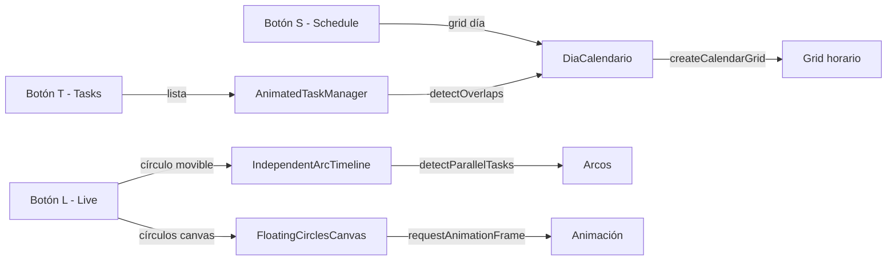

# Mockup "Hoy" — Vistas alternativas de Tasks (T / S / L) y su código en calendario_antiguo

> Análisis de las vistas a las que apuntan los botones **T / S / L** del mockup `nuevo_frontend.html`, y su correspondencia con el código más complejo de `calendario_antiguo`. Se detallan efectos, funciones y componentes de cada vista.

---

## 1. Los botones T / S / L y qué representan

En el mockup, la cabecera muestra una píldora con tres letras: **T** (activa), **S** y **L**. En `calendario_antiguo` este selector es `ToggleTabs` (`app/routes/cositos/menu.tsx`), y en la vista `Tareas` el `viewRegistry` define tres tabs: `day`, `week`, `schedule`.

Interpretación de las tres vistas de tareas:

| Botón | Vista | Descripción | Código en calendario_antiguo |
|---|---|---|---|
| **T** | **Tasks** (lista) | La lista de tareas del día (la que muestra el mockup). | `AnimatedTaskManager` (`TaskList.tsx`) en modo `day`. |
| **S** | **Schedule** (día por horas) | Grid horario del día con drag/resize de eventos. | `DiaCalendario` (`Dia.tsx`). |
| **L** | **Live** (círculo movible) | Círculo/dona interactivo donde las tareas son arcos movibles. | `IndependentArcTimeline` (`circulol.tsx`) y `FloatingCirclesCanvas` (`circulos.js`). |

> Nota: en `viewRegistry`, `Vista.Dia_1` → `DiaCalendario` y `Vista.Dia_2` → `IndependentArcTimeline`. La vista "Live" (círculo movible) es la que **en `calendario_antiguo` está incompleta** (ver §4).

---

## 2. Vista S — Schedule (día por horas): `Dia.tsx` (`DiaCalendario`)

Es el grid horario de 0–24h con filas de 15 min. Es la vista más completa y con más efectos.

### 2.1 Configuración de layout (`LAYOUT_CONFIG`)
- `HOUR_HEIGHT = 40`, `CALENDAR_HEIGHT`, `HOURS`, `MINUTES_PER_ROW`, `ROWS_PER_HOUR`.
- Tres columnas: `LEFT_SECTION_WIDTH`, `MIDDLE_SECTION_WIDTH` (grid), `RIGHT_SECTION_WIDTH`.

### 2.2 Estado y datos
- `currentDate` (fecha visible), `currentTime` (reloj, se actualiza cada 60s).
- `droppedEvents` (eventos soltados por hora), `sharedPremiosArray` (premios asociados a eventos).
- `filteredEvents` → `processedEvents` (vía `detectOverlaps`) → `grid` (vía `createCalendarGrid`).
- `startRow`/`endRow` calculados con `findGridRowForTime` para el rango visible.

### 2.3 Componentes internos
- **`DroppablePremio`**: zona de drop sobre cada grupo de eventos; asocia un premio (`idEvento`) y muestra su imagen circular; doble clic lo desasocia.
- **`TimeDivider`**: separadores de franjas (Morning/Noon/Evening/Night) con `TIME_DIVIDERS`.
- **`EventCard`**: tarjeta de evento con resumen, duración y rango horario.
- **`LeftColumn` / `RightColumn`**: columnas laterales del layout.
- **`GridWithGroups`**: el grid interactivo principal (ver §2.4).

### 2.4 `GridWithGroups` — efectos y funciones
- **Estado**: `hexToGoogleMapping`, `activeHuevada`, `activeGroup`, `resizeEdge`, `showOverlay`, `showOverlayUpdate`, `tempEvent`, `eventGroups`, `eventDetails`, `error`.
- **Refs**: `gridRef`, `startTop`, `startHeight`, `startY`.
- **Cálculo de geometría**:
  - `getEventBounds(event)` → `{top, end, height}` desde el grid.
  - `getGroupBounds(group)` → bounds del grupo (min top, max bottom).
  - `calculateEventStyle(event, group)` → ancho/posición para eventos solapados (divide en columnas).
- **Creación**:
  - `createNewEvent(top, end)` → evento temporal con `crypto.randomUUID()`.
  - `addMinutes(dateTime, minutes)` → suma minutos a un ISO.
- **Efectos**:
  - `useEffect` sincroniza `eventGroups` con `processedEvents`.
  - `useEffect` carga `buildHexToColorIdMapping(accessToken)` (mapea HEX ↔ colorId de Google).
  - `useEffect` registra `mousemove`/`mouseup` globales mientras hay `tempEvent`.
- **Interacción de arrastre/redimensionado**:
  - `handleMouseDown` → crea un evento temporal al hacer clic en el grid (snap a 10px).
  - `handleMouseMove` → mueve/redimensiona el evento según `resizeEdge` (`top`/`bottom`/`both`), con snap y límites; recalcula `start`/`end` con `findTimeForGridRow` y `addMinutes`.
  - `handleMouseUp` → confirma el evento: si es nuevo abre overlay, si no llama `handleUpdateEvent`.
  - `handleStartResize` → inicia redimensionado desde el borde superior/inferior.
- **Edición**:
  - `handleEventClick` → abre overlay de edición.
  - `updateEventDetails` → actualiza título/color y mapea a `colorId`.
  - `handleCreateEvent` → `createGoogleEventFromActiveSquare` + `createEvent` (POST a Google Calendar).
- **Render**: grid de horas, grupos de eventos (con `DroppablePremio`), overlay temporal, overlay de edición (título + selector de color).

### 2.5 Funciones de apoyo (en `lib/calendario.tsx`)
- `detectOverlaps(events)` → agrupa eventos solapados en `TaskBlock[]`.
- `createCalendarGrid(hourHeight)` → grid de filas de 15 min con `top`/`height`.
- `findGridRowForTime` / `findTimeForGridRow` → conversión tiempo ↔ fila.
- `createGoogleEventFromActiveSquare` → construye el evento Google desde el square.
- `upsertEvent` / `createEvent` / `updateEvent` / `deleteEvent` → CRUD contra Google Calendar.

---

## 3. Vista L — Live (círculo movible): `circulol.tsx` + `circulos.js`

Es la vista "Monitor" (`Vista.Dia_2`). Hay **dos implementaciones** del círculo movible.

### 3.1 `IndependentArcTimeline` (`circulol.tsx`) — arcos de tareas
Representa cada tarea como un **arco** en un círculo; el ángulo del arco = hora del día.

- **Estado**: `tasks` (`{id, startAngle, endAngle, color, radius}`), `dragging` (`{taskId, type: 'start'|'end'}`).
- **Geometría**:
  - `angleToCoords(angle, radius)` → coordenadas cartesianas.
  - `createTaskArcPath(task)` → path SVG del arco (con `largeArcFlag`).
- **Detección de paralelismo**:
  - `detectParallelTasks()` → agrupa tareas cuyos ángulos se solapan.
  - `adjustRadiiForParallelTasks(tasks)` → desplaza el radio de tareas paralelas para que no se solapen visualmente.
- **Efecto de arrastre** (`useEffect` con `dragging`):
  - `handleMouseMove` → calcula el ángulo desde el centro al cursor y actualiza `startAngle`/`endAngle` del arco arrastrado (con límites 0–360 y garantía de que `end > start`).
  - `handleMouseUp` → elimina arcos de longitud 0 y reajusta radios.
- **Render**:
  - `renderTasks()` → dibuja cada arco con grosor según paralelismo (`baseThickness / group.length`), y **handles** circulares arrastrables en ambos extremos.
  - Círculo de referencia, punto central, y panel de detalles (ángulos y radios por tarea).

### 3.2 `InteractiveDonut` (`circulol.tsx`) — dona de segmentos
- **Estado**: `segments` (`{id, startAngle, endAngle, color}`), `activeSegment`.
- **Efectos/funciones**:
  - `calculateAngle` / `normalizeAngle` → ángulo del cursor.
  - `handleDonutMouseDown` → crea un segmento nuevo.
  - `handleSegmentMouseDown` → selecciona un segmento para arrastrar.
  - `handleMouseMove` → redimensiona el segmento con `SMOOTHING_FACTOR = 0.5` y `requestAnimationFrame`.
  - `handleMouseUp` → suelta el segmento.
  - `polarToCartesian` / `createArc` / `createCurvedText` → dibujo SVG.
- **Render**: arcos de `TIME_DIVIDERS` (Morning/Noon/Evening/Night) con colores, etiquetas curvas, dona de fondo, y segmentos con etiqueta de hora (`TimeUtils.angleToTime`).

### 3.3 `FloatingCirclesCanvas` (`circulos.js`) — círculos flotantes (canvas)
Es la versión "círculos movibles" sobre `<canvas>` (la que el usuario menciona como **no completada**).

- **Estado**: `circlesRef`, `dragging`, `draggedCircleIndex`, `popupOpen`, `selectedTask`, `typeee`, `lastClickTime`.
- **Efectos**:
  - `useEffect` (inicialización): crea los círculos con `recreateCircles`, define `drawCircle`, `drawSmallCircle`, `redraw`, `updateCircles` (bucle de animación con `requestAnimationFrame`), y `handleCanvasClick`.
  - `useEffect` (interacción): `handleMouseMove`, `handleMouseDown`, `handleMouseUp` para arrastrar círculos.
- **Funciones**:
  - `recreateCircles` → crea círculos desde `tasks` con posición/velocidad aleatoria.
  - `updateCircles` → anima el movimiento (rebote en bordes, deriva aleatoria) y actualiza los "small circles".
  - `handleCircleClick` → doble clic abre `EventFromTaskPopup` (convertir tarea a evento); clic simple pausa/reanuda el movimiento.
  - `handleSmallCircleClick` → acciones secundarias (toggle de color).
- **Integración**: usa `EventFromTaskPopup` (`Tareas_Eventos.js`) para convertir tarea ↔ evento.

### 3.4 Por qué "Live" está incompleto en `calendario_antiguo`
- `IndependentArcTimeline` usa **datos hardcodeados** (dos tareas de ejemplo) y **no lee las tareas reales** de `useProject()` (a diferencia de `InteractiveDonut`, que sí usa `tasks`).
- `FloatingCirclesCanvas` es un prototipo en canvas con lógica de animación, pero no está conectado al flujo principal de datos ni a la persistencia.
- No hay sincronización de los ángulos/posiciones con las horas reales de las tareas ni con Google Calendar.

---

## 4. Cómo se conectan las tres vistas

- **T** y **S** comparten la misma fuente de datos (`tasks` de `useProject()` + `detectOverlaps`): la lista y el grid son dos representaciones del mismo día.
- **L** es la vista más experimental: intenta representar el día como un círculo donde el ángulo = hora, con arrastre de arcos (timeline circular) o círculos flotantes animados.

---

## 5. Efectos y funciones clave a conservar (resumen)

| Vista | Efectos/funciones destacados |
|---|---|
| **Schedule (Dia.tsx)** | `detectOverlaps`, `createCalendarGrid`, `findTimeForGridRow`, drag/resize con snap, `DroppablePremio`, overlay de edición, mapeo HEX↔colorId, CRUD Google. |
| **Live (circulol.tsx)** | `detectParallelTasks`, `adjustRadiiForParallelTasks`, arrastre de arcos (start/end), `InteractiveDonut` con `SMOOTHING_FACTOR`, `TIME_DIVIDERS`. |
| **Live (circulos.js)** | `requestAnimationFrame` (animación), rebote en bordes, arrastre de círculos, doble clic → popup de conversión tarea↔evento. |

---

## 6. Recomendaciones para NeuroPlanner

1. **Unificar la fuente de datos**: las tres vistas deben leer las mismas tareas (hoy `IndependentArcTimeline` usa datos hardcodeados).
2. **Completar "Live"**: conectar los arcos a las horas reales de las tareas y persistir los cambios de ángulo como cambios de hora.
3. **Reutilizar `detectOverlaps`** para el grid (Schedule) y `detectParallelTasks` para el círculo (Live): son dos formas de resolver el mismo problema (solapamiento) en geometrías distintas.
4. **Mantener el patrón de `TIME_DIVIDERS`** (Morning/Noon/Evening/Night) tanto en el grid como en la dona.
5. **El mockup solo muestra la vista T**; S y L son las vistas "ocultas" que el mockup sugiere con los botones, y su implementación más completa está en `Dia.tsx` y `circulol.tsx`/`circulos.js`.

Ver también: [`MOCKUP_TASKS_ANALISIS.md`](./MOCKUP_TASKS_ANALISIS.md) y [`CALENDARIO_ANTIGUO_FUNCIONALIDADES.md`](./CALENDARIO_ANTIGUO_FUNCIONALIDADES.md).
